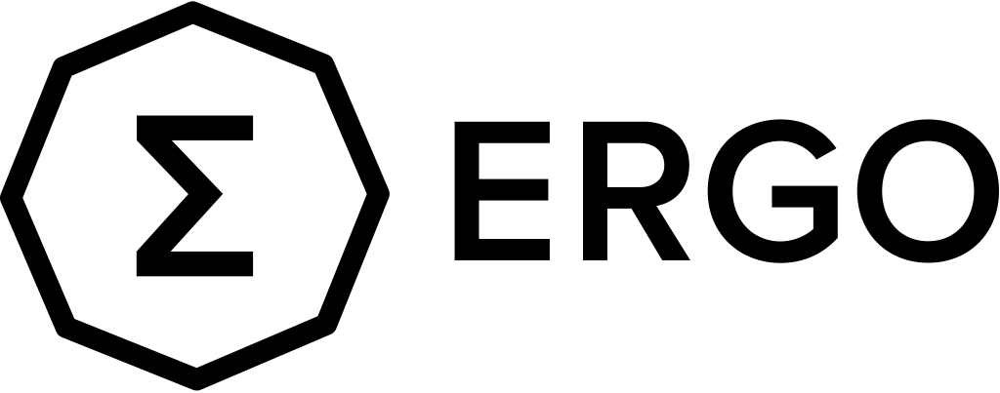

<p align="center" style="background-color:white;padding-top: 10px">
    <picture>
      
    </picture>
</p>

# BTA1stProject-20

## Introduction

에르고 월렛(Ergo Wallet) 서비스는 니모닉 및 지갑 생성, 잔고 조회, 송금을 가능하게 하는 [Ergo](https://ergoplatform.org/)에 특화된 Chrome Extension 지갑입니다.

## Developers
* Ergo image container가 띄워져 있어야 합니다. (port `9052`)
* wallet/**proxy**에서 `npm run start` 로 proxy 시작
* wallet/**client**에서 `npm run start` 후 localhost:3000/test page에서 확인 가능
* 🚨 **(중요!!!)** clienet/**.env**에 api key와 password를 입력해야 정상 동작

## Getting Started

> ⚠️ 모든 명령어는 root directory를 기준으로 작성되었습니다.

### Install

```shell
# client npm 패키지 설치 및 빌드
cd client && npm install && npm run build

# api server npm 패키지 설치 및 빌드
cd server && npm install && npm run build
```

### Api server run

```shell
# api server 실행
cd server && npm run start
```

### Chrome extension 설치 및 실행

1. 위에서 빌드한 `/build` directory를 [chrome extension](chrome://extensions/)에 추가
2. 크롬 익스텐션 실행

## References

* [Ergo official website](https://ergoplatform.org/)